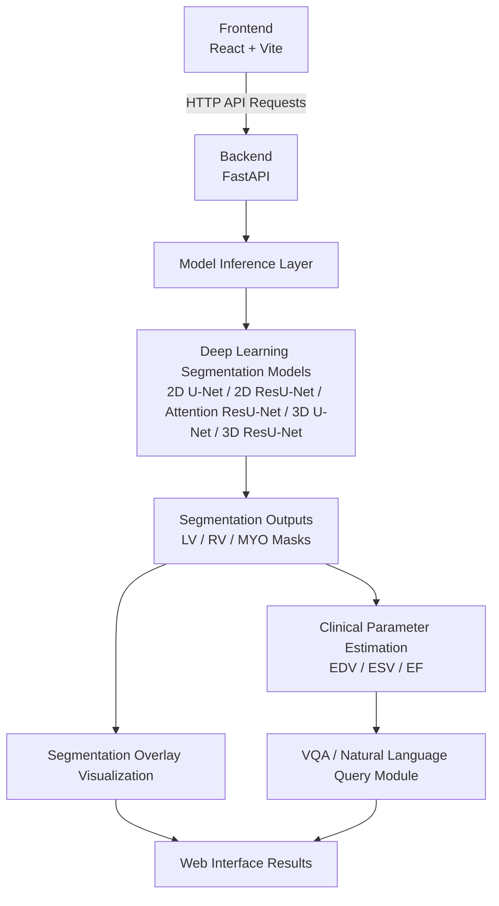

# Cardiac MRI Segmentation and Clinical Parameter Estimation with VQA

Web-based application for automatic cardiac MRI segmentation, clinical functional parameter estimation, and VQA-based natural language querying using deep learning models.

The system segments key anatomical structures from short-axis cardiac MR images, estimates EDV, ESV, and EF values, and presents the results through an interactive React-based web interface.

> This repository is a personal fork of the original graduation project repository, prepared for individual contribution tracking and portfolio presentation.


## My Contributions

This repository is a portfolio-oriented version of my graduation project. My main contributions include:

- Development and evaluation of 2D and 3D cardiac MRI segmentation models
- Clinical parameter estimation from LV segmentation masks
- Integration of patient-level structured outputs with a natural language query module
- Frontend interface design and backend API integration
- Preparation of visual outputs and documentation for academic presentation

---

## Demo Preview


<p align="center">
  <em>Web interface for selecting patient cases and visualizing segmentation outputs with clinical parameters.</em>
</p>

---

## Project Overview

This project provides an end-to-end pipeline for cardiac MRI analysis:

- Automatic segmentation of cardiac anatomical structures:
  - Left Ventricle (LV)
  - Right Ventricle (RV)
  - Myocardium (MYO)

- Estimation of clinical functional parameters:
  - End-Diastolic Volume (EDV)
  - End-Systolic Volume (ESV)
  - Ejection Fraction (EF)

- Visualization of segmentation overlays through a web interface

- VQA-based natural language querying over structured segmentation and clinical metric outputs

The system consists of a FastAPI-based backend for inference and result processing, and a React + Vite frontend for interactive visualization.

---

## Example Segmentation Output

<p align="center">
  <
</p>

<p align="center">
  <em>Example cardiac MRI segmentation result showing MRI image, ground truth overlay, and predicted overlay.</em>
</p>


---

## Key Features

- Deep learning-based cardiac MRI segmentation
- Support for LV, RV, and MYO anatomical classes
- EDV, ESV, and EF estimation from segmentation masks
- ED and ES phase-based analysis
- Web-based visualization of segmentation overlays
- Natural language querying over patient-level structured results
- FastAPI backend and React frontend integration
- Modular project structure for backend, frontend, and model notebooks

---

## System Architecture


The system consists of a React + Vite frontend for user interaction, a FastAPI backend for inference and result processing, deep learning segmentation models for cardiac MRI analysis, a clinical parameter estimation module for EDV/ESV/EF computation, and a VQA module for natural language querying over structured patient-level outputs.

## Dataset

This project uses the ACDC MICCAI 2017 dataset, which contains short-axis cardiac MRI volumes with expert annotations.

| Property | Description |
|---|---|
| Dataset | ACDC - Automated Cardiac Diagnosis Challenge |
| Source | MICCAI 2017 |
| Image Type | Short-axis cardiac MRI |
| Classes | Background, RV, MYO, LV |
| Phases | End-Diastole (ED), End-Systole (ES) |

The dataset provides manually annotated cardiac MRI cases, including end-diastolic and end-systolic phases.


## Deep Learning Models

The following architectures were evaluated during the research phase:

| Model | Purpose |
|---|---|
| 2D U-Net | Baseline encoder-decoder segmentation model |
| 2D ResU-Net | Residual U-Net architecture for improved feature learning |
| Attention ResU-Net | Residual U-Net with attention mechanisms |
| 3D U-Net | Volumetric segmentation using 3D spatial context |
| 3D ResU-Net | Residual 3D U-Net architecture |

The final web interface focuses on patient-level visualization, clinical metric presentation, and natural language querying.


## Clinical Parameter Estimation

Clinical functional parameters are calculated from the predicted Left Ventricle (LV) segmentation masks.

| Parameter | Description |
|---|---|
| EDV | End-Diastolic Volume |
| ESV | End-Systolic Volume |
| EF | Ejection Fraction |

The ejection fraction is calculated as:

```text
EF (%) = ((EDV - ESV) / EDV) × 100
```

## Results Summary

The experimental evaluation showed that 2D-based models provided more stable segmentation performance on the ACDC dataset. Among the evaluated architectures, the 2D ResU-Net model achieved the most reliable overall performance for cardiac structure segmentation.

### Clinical Metric Error

| Metric | Mean Absolute Error |
|---|---:|
| EDV | 6.58 mL |
| ESV | 6.27 mL |
| EF | 3.11 percentage points |

> These results are based on the final evaluation setup used in the graduation project.

## VQA-Based Natural Language Querying

The VQA module allows users to query patient-level cardiac MRI analysis results using natural language.

Instead of directly interpreting raw MRI images, the module uses structured outputs obtained from:

- Segmentation masks
- Clinical parameter calculations
- Patient-level EDV, ESV, and EF values
- Rule-based clinical interpretation outputs

Example queries:

- What is the ejection fraction of this patient?
- Is the EF value within the normal range?
- What are the EDV and ESV values?
- Which cardiac structures were segmented?
- Can these results be clinically interpreted?

This design makes the system more interpretable and traceable because the answers are based on measurable segmentation and clinical metric outputs rather than unrestricted image interpretation.

## Tech Stack

| Layer | Technologies |
|---|---|
| Backend | Python, FastAPI, PyTorch, NumPy, SimpleITK, NiBabel |
| Frontend | React, Vite, Axios, Material UI |
| Tools | Git, GitHub, VS Code, Jupyter Notebook |

## Repository Structure

```text
cardiac-mri-segmentation-vqa/
├── backend/
│   ├── app/
│   ├── models/
│   ├── services/
│   ├── main.py
│   └── requirements.txt
│
├── frontend/
│   ├── src/
│   ├── public/
│   └── package.json
│
├── notebooks/
│   └── model_training_and_evaluation.ipynb
│
├── README.md
└── .gitignore
```

> Large generated files, trained model checkpoints, and dataset files are not included in this repository.

## Installation

### 1. Clone the repository

```bash
git clone https://github.com/zehra-kaya16/cardiac-mri-segmentation-vqa.git
cd cardiac-mri-segmentation-vqa
```

### 2. Backend setup

```bash
cd backend
python -m venv venv
venv\Scripts\activate
pip install -r requirements.txt
uvicorn main:app --reload
```

The backend runs at:

```text
http://127.0.0.1:8000
```

### 3. Frontend setup

```bash
cd frontend
npm install
npm run dev
```

The frontend runs at:

```text
http://localhost:5173
```

## Notes

Large generated files, trained model checkpoints, and dataset files are not included in this repository.

This repository focuses on:

- Source code
- Web application structure
- Model integration logic
- Example visual outputs
- Project documentation

## Academic Context

This project was developed as a Computer Engineering graduation project. It combines medical image segmentation, clinical parameter estimation, and natural language querying for cardiac MRI analysis.

## Medical Disclaimer

This project is intended for academic and research purposes only. The outputs are generated from automatic segmentation results and are not intended for direct clinical decision-making.

## License

This project is provided for academic and educational purposes.

## Acknowledgements

- ACDC MICCAI 2017 Challenge organizers
- PyTorch community
- FastAPI community
- React and Vite communities
